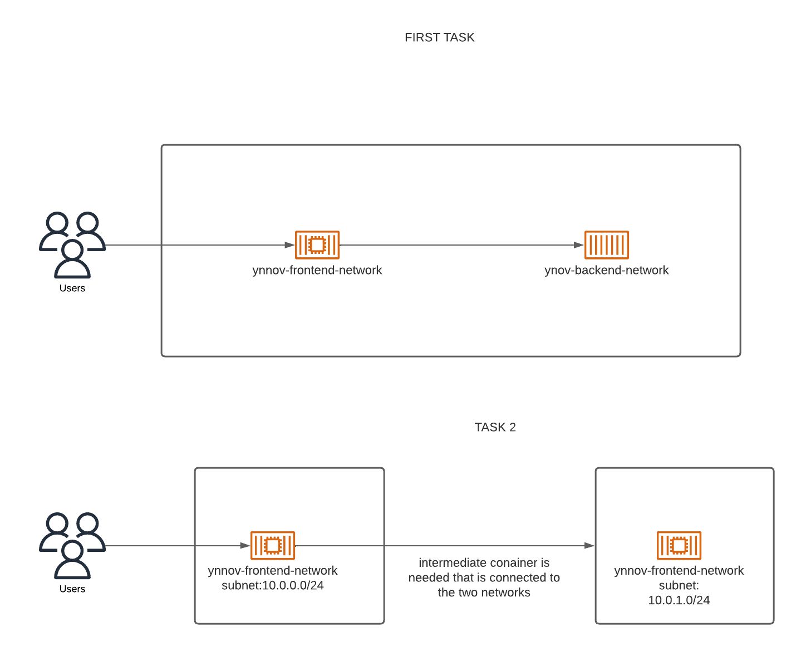

# TP : Mise en réseau Docker

Le "TP : Mise en réseau Docker" est un travail noté en **groupe de deux**. Les membres du groupes sont :
- SUPREME Chelson ;
- GAIO Lucas. 

Ce travail a pour objectif de faire **communiquer les deux conteneurs**. 

## Sommaire
- [Fonctionement](##Fonctionement)
  - [Fichiers](###Fichiers)
- [Consignes](##Consignes)
  - [Etape I](###Etape-I)
  - [Etape II](###Etape-II)
  - [Etape III](###Etape-III)
  - [Etape IV : rendu](###Etape-IV-:-rendu)

## Fonctionement

### Fichiers

### Création 

1. Création du réseau : `docker network create ynov-network` ;
2. Créer les conteneurs : ;
4. Lancer le conteneur sur le réseau à une adresse spécifique : le front `docker run --network ynov-network --name ynov-frontend-network --ip 10.0.0.0`, le back `docker run --network ynov-network --name ynov-backend-network --ip 10.0.1.0` et le routeur `docker run --network ynov-network --name passerelle --ip 10.0.2.0` ;
5. Vérifier que tout fonctionne correctement : `docker network inspect ynov-network` ;

`docker run --name <nom> <image>`

### Utilisation

## Consignes 

Déployer une application de e-commerce. Voir l'architecture ci-dessous :

### Etape I

1. Utiliser l'[image Prestashop, disponible ici](https://hub.docker.com/r/bitnami/prestashop).
2. Création d'un fronten et d'une base de données pour stocker des données persistantes.

### Etape II

Déployer dans le même réseau.

### Etape III

Déployer dans deux réseaux différents et s'assurer qu'ils peuvent communiquer ensemble, en utilisant leur nom.

1. Créer le réseau front avec l'IP `10.0.0.0/24` du nom "ynov-frontend-network" ;
2. Créer le réseau back avec l'IP `10.0.1.0/24` du nom "ynov-backend-network" ;
3. Utiliser `--subnet`, pour ajouter un sous-réseau au réseau lors de sa création ;
4. Faire communiquer les deux conteneurs, avec un troisième conteneur "passerelle" ou "routeur" pour les connecter ;
5. Configurer la table de routage dans la passerelle en utilisant la commande `ip route ajouter <FROM_CIDR_REPLACE_ME> via <GATEWAY_IP_FROM_EACH_NETWORK_SIDE>`. Faire la même commande pour les deux réseaux.

L'objectif est de faire communiquer les deux routeurs par leurs IP, pas spécialement de faire fonctionner le site.

### Etape IV : rendu

- Groupe de 2 ;
- PDF contenant les captures d'écran des étapes et descriptions ;
- Github public, mettre le lien du gitbuh sur moodle ;
- Readme.md : table des matières, sections, écrans, etc. qui montrent votre travail ;